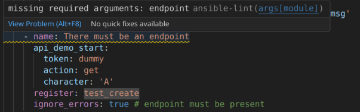

# Ansible library demo

A small demonstration to show how you make a simple Ansible Module.

Bas Magré <bas.magre@babelvis.nl>

If you have Ansible automation within your organization that needs to communicate with a custom API, you can solve this in several ways. Perhaps a few curl commands in bash lines with `ansible.builtin.shell`. It's not pretty, but you could create a task with inputs. A better approach would be to create a module. It sounds complicated, but it's actually quite manageable if you have a little Python knowledge.

For this example, we have a simple API that we need to call from Ansible. The power of Ansible is that it only makes changes when necessary (idempotent). So, you need to take this into account in your module. Compare existing values ​​with what (possibly) needs to be changed.

## Run demo API

There is a demo API in the folder `api-dotnet-src` we only need to run the docker container. But the source code is here if you want to see it.

```bash
cd api-dotnet-src
# # build the docker image (already done)
# docker build . -t opvolger/demo-api-ansible
# # push the docker image to docker hub (already done, only I can do this)
# docker push opvolger/demo-api-ansible
# # run the docker container (you only need to do this)
docker run -p 5041:8080  opvolger/demo-api-ansible
```

You now can visit the swagger interface of the demo API: [http://localhost:5041/swagger](http://localhost:5041/swagger)

It's a key-value store, with the key always being a single uppercase letter and the value being a number.

This API allows you to retrieve, modify, or add a current value.

## Create the module

An Ansible module must be written in Python (for Linux). This should be placed under your playbook folder in the "library" folder. You can find more information on the [ansible docs](https://docs.ansible.com/ansible/latest/dev_guide/developing_modules_general.html).

### Figure out what your input variables should be

We have a simple API that can get, set, change and delete a key-value pair. The key must be a letter and the value a number. The API needs authentication with username and password or with a token. See [Run demo API](#-Run-demo-API) for the complete definition.
In Ansible we need to build a module that can set/get a character-key/number-value and clear all characters. This is what we need in the playbooks.

So we need:

- the arguments character and number (key and value)
- 3 actions in the module: set, get and clear
- authentication with username/password OR the use of a token
- the endpoint where we can call the API.

Something like this:

```yaml
- name: Set number on a character with username and password
  api_demo:
    endpoint: http://localhost:5041/
    username: user
    password: password
    character: "A"
    number: 4
    action: set
  delegate_to: localhost
```

### Start with the documentation

If you know how to call the module. We can start with the documentation and empty implementation.

We use the class AnsibleModule for communication back to Ansible and set the variable `DOCUMENTATION`, `EXAMPLES` and `RETURN`.

Here is my implementation of [api_demo_start_doc.py](ansible-playbook/library/api_demo_start_doc.py):

```python
#!/usr/bin/python
from ansible.module_utils.basic import AnsibleModule

DOCUMENTATION = r'''
---
module: api_demo
author:
    - Bas Magré (@opvolger)
short_description: The ability to create, remove and manage a list of characters that have numbers
version_added: 0.0.1
description: "The ability to create, remove and manage a list of characters that have numbers. This is just a demo!"

options:
    endpoint:
        description: The uri of the API
        type: str
        required: true
        sample: 'http://localhost:5041/'
    username:
        description: Username to get a token
        type: str
        required: false
        sample: 'user'
    password:
        description: Password to get a token
        type: str
        required: false
        sample: 'password'
    token:
        description: Use a token direct (without username/password)
        type: str
        required: false
        sample: 'secret'
    character:
        description: Character (key)
        type: str
        required: false
        sample: 'A'
    number:
        description: Number (value)
        type: int
        required: false
        sample: 5
    action:
        description: The action to perform
        type: str
        required: true
        default: get
        choices: [ get, set, clear ]
        sample: 'set'
'''

EXAMPLES = r'''
- name: Clear all set character and numbers with a token
  api_demo:
    endpoint: http://localhost:5041/
    token: secret
    action: clear
  delegate_to: localhost

- name: Set number on a character with username and password
  api_demo:
    endpoint: http://localhost:5041/
    username: user
    password: password
    character: "A"
    number: 4
    action: set
  delegate_to: localhost

- name: Get number from set character with a token
  api_demo:
    endpoint: http://localhost:5041/
    token: secret
    character: "A"
    action: get
  delegate_to: localhost
'''

RETURN = r'''
exists:
    description: if the character is set
    returned: success
    type: bool
    sample: True
number:
    description: The number that is set or get
    type: int
    sample: 5
'''

def run_module():
    # define the available arguments/parameters that a user can pass to the module
    module_args = dict(
        endpoint=dict(type='str', required=True),
        username=dict(type='str', required=False),
        password=dict(type='str', required=False, no_log=True),
        token=dict(type='str', required=False, no_log=True),
        character=dict(type='str', required=False),
        number=dict(type='int', required=False),
        action=dict(type='str', required=True, choices=['get', 'set', 'clear'])
    )

    # the AnsibleModule object will be our abstraction working with Ansible
    # this includes instantiation, a couple of common attr would be the
    # args/params passed to the execution, as well as if the module
    # supports check mode
    module = AnsibleModule(
        argument_spec=module_args,
    )

    # seed the result dict in the object
    # we primarily care about changed and state
    # change is if this module effectively modified the target
    # state will include any data that you want your module to pass back
    # for consumption, for example, in a subsequent task
    result = dict(
        changed=False,
        rc=1,
        stdout=None,
        stderr=None
    )

    result['rc'] = 0  # we are at the end, no errors occurred
    module.exit_json(**result)

def main():
    run_module()

if __name__ == '__main__':
    main()

```

Now we can test if the documentation is correct with the commands.

```bash
# test doc generation
cd ansible-playbook
ANSIBLE_LIBRARY=./library ansible-doc -t module api_demo_start_doc
```

This should not give an error, but should display your module's documentation.

You can even debug this module, see: [Developer Setup](#-Developer-Setup)

### Continue with arguments

Our module can work with an username/password or with a token. There are more arguments that should or shouldn't be used in combination.

- if we use an username we need a password
- we need or username/password or token
- we can't user username/password and token together
- if we use the get command we need a character
- if we use the set command we need a character and number

We can implement this in the module like this [api_demo_start.py](ansible-playbook/library/api_demo_start.py)::

```python
    # use username with password
    check_required_together = [
        ('username', 'password')
    ]

    # use username/password or token is needed
    check_required_one_of = [ ('username', 'token')]

    # use username/password or token, only one
    check_mutually_exclusive = [ ('username', 'token')]

    # if action == get, we need the character argument
    # if action == set, we need the character and number arguments
    check_required_if = [
         ('action', 'get', ['character']),
         ('action', 'set', ['character','number'])
    ]

    # the AnsibleModule object will be our abstraction working with Ansible
    # this includes instantiation, a couple of common attr would be the
    # args/params passed to the execution, as well as if the module
    # supports check mode
    module = AnsibleModule(
        argument_spec=module_args,
        supports_check_mode=True,
        required_if=check_required_if,
        required_together=check_required_together,
        required_one_of=check_required_one_of,
        mutually_exclusive=check_mutually_exclusive
    )
```

You can put the arrays directly in the constructor of AnsibleModule, but I like to make comments on my variable. The module now looks like [this](ansible-playbook/library/api_demo_start.py).

For more information see [ansible docs](https://docs.ansible.com/ansible/latest/reference_appendices/module_utils.html)

You can debug this module, see: [Developer Setup](#-Developer-Setup)

### Make a class for the interaction

To maintain a clear overview and simplify development, you can encapsulate the entire interaction within a class. The advantage of a separate class is that you can essentially reuse this code outside of the Ansible module. Ideally, you could create a separate module for this and maintain it as a [Python packages](https://packaging.python.org/en/latest/tutorials/packaging-projects/) (provided you can/are allowed to make this code public).

For this example, I will eventually include the class in my Ansible module. But it could also have been an import, of course.

The module [demoapi.py](demoapi.py):

```python
import json
import requests
from typing import List
from urllib.parse import urljoin

class DemoApi:
    """
    A simple demo class where the API logic is written

    :param username: user that connect to API
    :param password: password from the user
    :param token: token can be user instead of username/password
    :param uri: the endpoint of the API
    :raises HTTPError: if one occurred
    """
    def __init__(self, username: str, password: str, token: str, uri: str):
        self.uri = uri
        self.session = requests.session()
        self.__connect(username, password, token)

    def __connect(self, username: str, password: str, token: str):
        if token:
            self.session.headers.update({'X-Auth-Token': token})
        else:
            response = self.session.post(urljoin(self.uri,"token"), json={"username": username, "password": password})
            response.raise_for_status()
            self.session.headers.update({'X-Auth-Token': response.text})

    def reset(self, character :str) -> None:
        """
        Reset will remove character from the set of characters that are set

        :param character: character to reset
        :raises HTTPError: if one occurred
        """ 
        response = self.session.delete(urljoin(self.uri,f"character/{character}"))
        response.raise_for_status()

    def set(self, character: str, number: int) -> None:
        """
        Set the number on a character

        :param character: character to set
        :param number: the number that will be given to the character

        :raises HTTPError: if one occurred
        """ 
        response = self.session.put(urljoin(self.uri,f"character/{character}?number={number}"))
        response.raise_for_status()

    def update(self, character: str, number: int) -> None:
        """
        Update the number on a character

        :param character: character to update
        :param number: the number that will be given to the character

        :raises HTTPError: if one occurred
        """ 
        response = self.session.post(urljoin(self.uri,f"character/{character}?number={number}"))
        response.raise_for_status()

    def get(self, character: str) -> int:
        """
        Get the number that is set on a character

        :param character: character where you want the number from

        :returns: the number that will be given to the character
        :raises HTTPError: if one occurred
        """ 
        response = self.session.get(urljoin(self.uri, f"character/{character}"))
        response.raise_for_status()
        return json.loads(response.text)

    def list(self) -> List[str]:
        """
        Get the list of characters that are set

        :returns: the list of characters that have a number
        :raises HTTPError: if one occurred
        """ 
        response = self.session.get(urljoin(self.uri,"character"))
        response.raise_for_status()
        return json.loads(response.text)
```

and some tests [test_demoapi.py](test_demoapi.py)

```python
import unittest
from demoapi import DemoApi

class Test_Api(unittest.TestCase):

    def setUp(self):
        self.demoApi = DemoApi('user', 'password', None, 'http://localhost:5041/')
        # clear all characters (if any)
        characters = self.demoApi.list()
        for character in characters:
            self.demoApi.reset(character)
    
    # yes i know, only test 1 thing every test...
    def test_username(self):
        characters = self.demoApi.list()
        for character in characters:
            self.demoApi.reset(character)
        # set A and B
        self.demoApi.set('A', 5)
        self.demoApi.set('B', 7)
        # check value of A
        check = self.demoApi.get('A')
        assert check == 5
        # check list
        check = self.demoApi.list()
        assert len(check) == 2
        assert 'A' in check
        assert 'B' in check

    # test token
    def test_token(self):
        self.demoApi = DemoApi(None, None, 'secret', 'http://localhost:5041/')
        # set A and B
        self.demoApi.set('A', 5)
        # check value of A
        check = self.demoApi.get('A')
        assert check == 5

if __name__ == '__main_':
    unittest.main()
```

You can run the tests with the command 
```bash
python -m unittest discover -v -p 'test_*.py'
```

### Combine it all in one Ansible Module

Now we can copy the class in the Ansible module and connect them together.

You can use the module to ask if the user is in [check mode](https://docs.ansible.com/ansible/2.8/user_guide/playbooks_checkmode.html). That is in the property `module.check_mode`. if that is true, do not make changes or don't support it (supports_check_mode=False) in the initialization of the AnsibleModule.

This is the finished module [api_demo.py](ansible-playbook/library/api_demo.py):

```python
#!/usr/bin/python

import requests
import json
import re
from ansible.module_utils.basic import AnsibleModule
from urllib.parse import urljoin
from typing import List

class DemoApi:
    """
    A simple demo class where the API logic is written

    :param username: user that connect to API
    :param password: password from the user
    :param token: token can be user instead of username/password
    :param uri: the endpoint of the API
    :raises HTTPError: if one occurred
    """
    def __init__(self, username: str, password: str, token: str, uri: str):
        self.uri = uri
        self.session = requests.session()
        self.__connect(username, password, token)

    def __connect(self, username: str, password: str, token: str):
        if token:
            self.session.headers.update({'X-Auth-Token': token})
        else:
            response = self.session.post(urljoin(self.uri,"token"), json={"username": username, "password": password})
            response.raise_for_status()
            self.session.headers.update({'X-Auth-Token': response.text})

    def reset(self, character :str) -> None:
        """
        Reset will remove character from the set of characters that are set

        :param character: character to reset
        :raises HTTPError: if one occurred
        """ 
        response = self.session.delete(urljoin(self.uri,f"character/{character}"))
        response.raise_for_status()

    def set(self, character: str, number: int) -> None:
        """
        Set the number on a character

        :param character: character to set
        :param number: the number that will be given to the character

        :raises HTTPError: if one occurred
        """ 
        response = self.session.put(urljoin(self.uri,f"character/{character}?number={number}"))
        response.raise_for_status()

    def update(self, character: str, number: int) -> None:
        """
        Update the number on a character

        :param character: character to update
        :param number: the number that will be given to the character

        :raises HTTPError: if one occurred
        """ 
        response = self.session.post(urljoin(self.uri,f"character/{character}?number={number}"))
        response.raise_for_status()

    def get(self, character: str) -> int:
        """
        Get the number that is set on a character

        :param character: character where you want the number from

        :returns: the number that will be given to the character
        :raises HTTPError: if one occurred
        """ 
        response = self.session.get(urljoin(self.uri, f"character/{character}"))
        response.raise_for_status()
        return json.loads(response.text)

    def list(self) -> List[str]:
        """
        Get the list of characters that are set

        :returns: the list of characters that have a number
        :raises HTTPError: if one occurred
        """ 
        response = self.session.get(urljoin(self.uri,"character"))
        response.raise_for_status()
        return json.loads(response.text)

DOCUMENTATION = r'''
---
module: api_demo
author:
    - Bas Magré (@opvolger)
short_description: The ability to create, remove and manage a list of characters that have numbers
version_added: 0.0.1
description: "The ability to create, remove and manage a list of characters that have numbers. This is just a demo!"

options:
    endpoint:
        description: The uri of the API
        type: str
        required: true
        sample: 'http://localhost:5041/'
    username:
        description: Username to get a token
        type: str
        required: false
        sample: 'user'
    password:
        description: Password to get a token
        type: str
        required: false
        sample: 'password'
    token:
        description: Use a token direct (without username/password)
        type: str
        required: false
        sample: 'secret'
    character:
        description: Character (key)
        type: str
        required: false
        sample: 'A'
    number:
        description: Number (value)
        type: int
        required: false
        sample: 5
    action:
        description: The action to perform
        type: str
        required: true
        default: get
        choices: [ get, set, clear ]
        sample: 'set'
'''

EXAMPLES = r'''
- name: Clear all set character and numbers with a token
  api_demo:
    endpoint: http://localhost:5041/
    token: secret
    action: clear
  delegate_to: localhost

- name: Set number on a character with username and password
  api_demo:
    endpoint: http://localhost:5041/
    username: user
    password: password
    character: "A"
    number: 4
    action: set
  delegate_to: localhost

- name: Get number from set character with a token
  api_demo:
    endpoint: http://localhost:5041/
    token: secret
    character: "A"
    action: get
  delegate_to: localhost
'''

RETURN = r'''
exists:
    description: if the character is set
    returned: success
    type: bool
    sample: True
number:
    description: The number that is set or get
    type: int
    sample: 5
'''

def run_module():
    # define the available arguments/parameters that a user can pass to the module
    module_args = dict(
        endpoint=dict(type='str', required=True),
        username=dict(type='str', required=False),
        password=dict(type='str', required=False, no_log=True),
        token=dict(type='str', required=False, no_log=True),
        character=dict(type='str', required=False),
        number=dict(type='int', required=False),
        action=dict(type='str', required=True, choices=['get', 'set', 'clear'])
    )

    # use username with password
    check_required_together = [
        ('username', 'password')
    ]

    # use username/password or token is needed
    check_required_one_of = [ ('username', 'token')]

    # use username/password or token, only one
    check_mutually_exclusive = [ ('username', 'token')]

    # if action == get, we need the character argument
    # if action == set, we need the character and number arguments
    check_required_if = [
         ('action', 'get', ['character']),
         ('action', 'set', ['character','number'])
    ]

    # the AnsibleModule object will be our abstraction working with Ansible
    # this includes instantiation, a couple of common attr would be the
    # args/params passed to the execution, as well as if the module
    # supports check mode
    module = AnsibleModule(
        argument_spec=module_args,
        supports_check_mode=True,
        required_if=check_required_if,
        required_together=check_required_together,
        required_one_of=check_required_one_of,
        mutually_exclusive=check_mutually_exclusive
    )

    # seed the result dict in the object
    # we primarily care about changed and state
    # change is if this module effectively modified the target
    # state will include any data that you want your module to pass back
    # for consumption, for example, in a subsequent task
    result = dict(
        changed=False,
        rc=1,
        stdout=None,
        stderr=None
    )

    endpoint = module.params['endpoint']
    username = module.params['username']
    password = module.params['password']
    token = module.params['token']
    character = module.params['character']
    number = module.params['number']
    action = module.params['action']

    # input checks
    if character != None and not (re.fullmatch(r"[A-Z]", character)):
        module.fail_json(msg=f'character: "{character}" must be an alpha letter and in upper case', **result)
    if number != None and not (1 <= number <= 255):
        module.fail_json(msg='number must be between 1 and 255', **result)

    demoApi = DemoApi(username, password, token, endpoint)

    # actions
    if action == 'get':
        # only get from API that is in the list
        characterList = demoApi.list()
        if (character in characterList):
            result['number'] = demoApi.get(character)
            result['exists'] = True
        else:
            result['exists'] = False
    elif action == 'set':
        characterList = demoApi.list()
        if (character in characterList):
            currentNumber = demoApi.get(character)
            if currentNumber != number:
                result['changed'] = True
                # if the user is working with this module in only check mode we do not want to make any changes to the environment.
                if not module.check_mode:
                    demoApi.update(character, number)
        else:
            result['changed'] = True
            # if the user is working with this module in only check mode we do not want to make any changes to the environment.
            if not module.check_mode:
                demoApi.set(character, number)
        result['number'] = number
        result['exists'] = True
    elif action == 'clear':
        characterList = demoApi.list()
        for characterClear in characterList:
            # if the user is working with this module in only check mode we do not want to make any changes to the environment.
            if not module.check_mode:
                demoApi.reset(characterClear)
            result['changed'] = True
            result['exists'] = False

    result['rc'] = 0  # we are at the end, no errors occurred
    module.exit_json(**result)

def main():
    run_module()

if __name__ == '__main__':
    main()
```

## Ansible Playbook

Now we have our module, we can make a playbook

```yaml
- name: Test my new module
  hosts: localhost
  tasks:
    - name: Clear all the characters
      api_demo:
        endpoint: http://localhost:5041/
        token: secret
        action: clear

    - name: Added the character A with value 1
      api_demo:
        endpoint: http://localhost:5041/
        token: secret
        action: set
        character: 'A'
        number: 1
```

Our work is done.

I you want more examples/tests see [playbook-demo.yaml](ansible-playbook/playbook-demo.yaml). If you open this file in VSCode with the extension Ansible you can see that the Ansible linter will see a lot of the new module just created.



## Developer Setup

There are multiple Ansible modules:

- [api_demo_start_doc.py](ansible-playbook/library/api_demo_start_doc.py): only documentation
- [api_demo_start.py](ansible-playbook/library/api_demo_start.py): with arguments checks
- [api_demo.py](ansible-playbook/library/api_demo.py): has the full implementation

The code for interaction the the demo api [demoapi.py](demoapi.py) and the tests for it [test_demoapi.py](test_demoapi.py)

### Python virtual environment

Normally I do use a [virtual environment](https://docs.python.org/3/library/venv.html), but since I only use standard modules/application that are already installed on my machine, I skip this for now.

If you want to use python environments, you can do it

```bash
# setup of the virtual environment (only onetime)
python -m venv venv
# use the venv
source venv/bin/activate
# install required python libs (only onetime), ansible-dev-tools is needed only for the Ansible extension in vscode
pip install ansible-core requests ansible-dev-tools
```

### Debug modules in vscode

In vscode, install the extension `Ansible` from `Red hat`. This can help you a lot.

For debugging the modules in vscode create file `.vscode/launch.json`. Here you can specify launch options.

```json
{
    // Use IntelliSense to learn about possible attributes.
    // Hover to view descriptions of existing attributes.
    // For more information, visit: https://go.microsoft.com/fwlink/?linkid=830387
    "version": "0.2.0",
    "configurations": [
        {
            "name": "Python Debugger: Ansible Module with Arguments",
            "type": "debugpy",
            "request": "launch",
            "program": "${file}",
            "console": "integratedTerminal",
            "args": [
                "${workspaceFolder}/tests/arguments.json"
            ]
        }
    ]
}
```

For the arguments create `tests/arguments.json`. Here you can set the arguments you want to pass to the module you are creating. You create more scenarios in different arguments-json files.

```json
{
    "ANSIBLE_MODULE_ARGS": {
        "endpoint": "http://localhost:5041/",
        "username": "user",
        "password": "password",
        "character": "B",
        "number": 4,
        "action": "set"
    }
}
```

Now you can hit `F5` if you have opened a module file and debug it with breakpoints.

### Ansible commands

You can use multiple command to test you module, here are some that i use to test the module.

## Generate/Test Docs

```bash
# test doc generation
cd ansible-playbook
ANSIBLE_LIBRARY=./library ansible-doc -t module api_demo
```

## Run the module

```bash
cd ansible-playbook
# with ansible
ANSIBLE_LIBRARY=./library ansible -m api_demo -a 'endpoint=http://127.0.0.1:5041/ token=secret action=clear' localhost
# with ansible-playbook
ansible-playbook playbook-demo-start.yaml -vvv
ansible-playbook playbook-demo.yaml -vvv
# the dry run (check), this will fail with our tests. But no values will change on the (api)server
ansible-playbook playbook-demo.yaml --check -vvv
```

### Make it greater

You can make a collection with this module. Create test in the collection itself and use the collection in playbooks. More information can be found on the [ansible docs](https://docs.ansible.com/ansible/latest/collections_guide/index.html).
